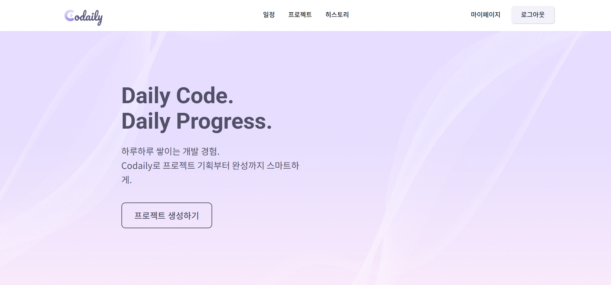

# Codaily - 개인 프로젝트 관리 플랫폼

## 프로젝트 소개


Codaily는 개인 프로젝트를 효율적으로 관리하고 일정을 체계적으로 운영할 수 있도록 지원하는 플랫폼입니다.  
이름은 **Code**와 **Daily**의 합성어로, 사용자가 매일 꾸준히 프로젝트를 진행하고 기록할 수 있음을 의미합니다.

Codaily를 통해 사용자는 다음과 같은 기능을 한 곳에서 수행할 수 있습니다:

- **할 일 관리**: 프로젝트별 작업을 등록, 수정, 완료 처리
- **일정 관리**: 마감일과 일정을 체계적으로 관리
- **명세서 생성**: 챗봇을 이용한 프로젝트 명세서 자동 생성
- **코드 리뷰 및 일일 회고**: 기능을 완성할 때마다 생성되는 코드 리뷰 및 하루마다 생성되는 일일 회고 확인

## 팀 소개

| Eun31 (팀장) | oesara | yeongenn | groomingkinglala | Seo-b-h | 이휘 |
|:---:|:---:|:---:|:---:|:---:|:---:|
| <a href="https://github.com/Eun31"></a> | <a href="https://github.com/oesara"></a> | <a href="https://github.com/yeongenn"></a> | <a href="https://github.com/groomingkinglala"></a> | <a href="https://github.com/Seo-b-h"></a> | <a href="https://github.com/hwi-lee"></a> |
| **BE, INFRA, 팀장** | **FE** | **FE** | **BE, AI** | **BE, AI** | **BE, INFRA** |
| [@Eun31](https://github.com/Eun31) | [@oesara](https://github.com/oesara) | [@yeongenn](https://github.com/yeongenn) | [@groomingkinglala](https://github.com/groomingkinglala) | [@Seo-b-h](https://github.com/Seo-b-h) | [@hwi-lee](https://github.com/hwi-lee) |

## 주요 기능

#### 프로젝트 생성 및 일정 관리
- 사용자가 새로운 프로젝트를 생성하고, 개인 스케줄에 맞춰 프로젝트 일정을 자동/수동으로 수립할 수 있습니다.
- 작업 가능한 날짜와 요일을 입력하면 AI가 최적의 일정안을 추천합니다.

#### 요구사항 명세서 자동 생성
- AI와의 대화를 통해 프로젝트의 주제, 기능, 세부 기능까지 계층적으로 분해된 요구사항 명세서를 생성합니다.
- 실시간 스트리밍(SSE)으로 생성 결과를 빠르게 확인할 수 있습니다.

#### 코드 리뷰 자동화
- GitHub 레포지토리와 연동하여 커밋 기록 기반 코드 리뷰를 자동으로 제공합니다.
- 기능 구현 체크리스트 기반으로 구현 완료 여부를 감지하고, 코딩 컨벤션·버그 위험도·복잡도·리팩토링 제안·성능 최적화 등 항목별 피드백을 제시합니다.

#### 일일 회고 자동 생성
- 매일 정해진 시각 또는 사용자의 요청 시, AI가 커밋 기록과 작업 로그를 분석해 일일 회고 리포트를 생성합니다.
- 회고 리포트에는 완료된 기능, 생산성 지표, 코드 품질 점수, 개선 제안 등이 포함됩니다.

#### 생산성 및 진행률 분석
- 커밋 수, 기능 완료율, 코드 품질 지표를 기반으로 생산성 그래프와 진행 상황 대시보드를 제공합니다.
- 주별·월별 커밋 통계와 점수를 시각화하여 사용자가 자신의 개발 패턴을 쉽게 파악할 수 있습니다.

#### GitHub 연동
- 기존 레포지토리를 연결하거나 새 레포지토리를 생성하여 프로젝트 관리에 바로 활용할 수 있습니다.
- Webhook을 통해 커밋 이벤트를 자동으로 감지하고 AI 기능(코드 리뷰, 회고 등)과 연동됩니다.

## System Archetacture


## Skills

#### Frontend


#### Backend


#### AI


#### Database


#### Deployment & Infrastructure


## 프로젝트 구조

### FE (React 프론트엔드)

```
FE/
├── public/
├── src/
│   ├── apis/              
│   ├── assets/            
│   ├── components/        
│   │   ├── atoms/
│   │   ├── ChatbotMessage/
│   │   ├── ChatInputBar/
│   │   ├── ChatProgressBar/
│   │   ├── ChatUserMessage/
│   │   ├── layouts/
│   │   ├── molecules/
│   │   ├── organisms/
│   │   ├── RequirementsSpecification/
│   │   └── ReviewDetailSidebar/
│   ├── hooks/
│   ├── pages/
│   │   ├── AdditionalInfo/
│   │   ├── History/
│   │   ├── Home/
│   │   ├── Login/
│   │   ├── MyPage/
│   │   ├── Project/
│   │   ├── ProjectCreate/
│   │   ├── Schedule/
│   │   └── Signup/
│   ├── queries/
│   ├── store/
│   └── stores/
├── package.json
└── vite.config.js (예시)
```

### BE (Spring Boot 백엔드)

```
BE/
├── build.gradle # Gradle 빌드 설정
├── settings.gradle
├── gradle/
│ └── wrapper/
├── src/
│ ├── main/
│ │ ├── java/
│ │ │ └── com/codaily/
│ │ │ ├── auth/
│ │ │ │ ├── config/
│ │ │ │ ├── controller/
│ │ │ │ ├── entity/
│ │ │ │ ├── handler/
│ │ │ │ ├── repository/
│ │ │ │ └── service/
│ │ │ ├── codereview/
│ │ │ │ ├── config/
│ │ │ │ ├── controller/
│ │ │ │ ├── dto/
│ │ │ │ ├── entity/
│ │ │ │ ├── repository/
│ │ │ │ └── service/
│ │ │ ├── common/
│ │ │ │ ├── file/
│ │ │ │ ├── git/
│ │ │ │ └── gpt/
│ │ │ ├── global/
│ │ │ │ ├── config/
│ │ │ │ └── exception/
│ │ │ ├── management/
│ │ │ │ ├── component/
│ │ │ │ ├── controller/
│ │ │ │ ├── dto/
│ │ │ │ ├── entity/
│ │ │ │ ├── exception/
│ │ │ │ ├── repository/
│ │ │ │ └── service/
│ │ │ ├── mypage/
│ │ │ │ ├── controller/
│ │ │ │ ├── dto/
│ │ │ │ └── service/
│ │ │ ├── project/
│ │ │ │ ├── controller/
│ │ │ │ ├── dto/
│ │ │ │ ├── entity/
│ │ │ │ ├── exception/
│ │ │ │ ├── repository/
│ │ │ │ └── service/
│ │ │ └── retrospective/
│ │ │ ├── component/
│ │ │ ├── config/
│ │ │ ├── controller/
│ │ │ ├── dto/
│ │ │ ├── entity/
│ │ │ ├── repository/
│ │ │ └── service/
│ │ └── resources/
│ │ └── fonts/
│ └── test/
│ └── java/com/codaily/project/
│ ├── repository/
│ └── service/
└── uploads/
└── profiles/
```

### AI (FastAPI 기반 AI 모듈)

```
AI/
├── main.py
├── requirements.txt
├── Dockerfile
└── src/
    ├── code_review/
    │   └── graph/
    ├── config/
    ├── retrospective/
    └── specification/
```

## 구성 요소 및 역할

### 프론트엔드 (FE)

React 기반의 프론트엔드 모듈로, 사용자에게 Codaily의 다양한 기능을 제공하는 웹 애플리케이션 인터페이스를 담당합니다. SPA(Single Page Application) 아키텍처로 구성되어 React Router를 통해 주요 페이지 간 라우팅을 제공하며, Axios 등을 사용하여 백엔드 API와 통신합니다. 주요 화면으로는 프로젝트 목록 및 생성 페이지, 프로젝트 상세 (할일 리스트, 일정 캘린더), 대시보드 등이 있습니다. UI 프레임워크로 Material-UI를 활용하여 일관된 디자인과 반응형 웹을 구현하였으며, 상태 관리를 위해 Context API 또는 Redux를 사용해 컴포넌트 간 데이터를 효율적으로 관리합니다.

### 백엔드 (BE)

Spring Boot로 구현된 RESTful API 서버로, Codaily 플랫폼의 핵심 비즈니스 로직과 데이터 관리를 담당합니다. 주요 역할은 프론트엔드 클라이언트에 JSON 형태의 API를 제공하는 것으로, 사용자 인증, 프로젝트 및 할일 CRUD 기능, 일정 관리, 그리고 AI 서버와의 연동을 포함합니다. 데이터베이스로 PostgreSQL을 사용하고 있으며, Spring Data JPA를 통해 ORM 방식으로 데이터 접근을 구현했습니다. 또한 Spring Security를 적용하여 안전한 인증 및 권한 관리를 수행하며, JWT 토큰을 통한 stateless 인증으로 확장성 있게 사용자 세션을 관리합니다. 백엔드는 AI 서버에 HTTP 요청을 보내어 필요한 인공지능 기능(예: 코드 리뷰, 명세서 생성)을 수행하고 그 결과를 프론트엔드에 전달하는 중개 역할도 합니다.

### AI 서버 (AI)

Python 기반의 FastAPI 서버로서 동작하는 독립 모듈입니다. Codaily 내에서 인공지능 관련 기능(명세서 생성, 코드 리뷰, 일일 회고)을 제공하며, 백엔드와의 통신을 통해 해당 요청을 처리합니다. 예를 들어, 사용자의 프로젝트 설명을 입력받아 GPT API로부터 명세서를 생성하거나, 프로젝트 메모 내용을 분석하여 요약 정보를 추출하는 등의 기능을 수행합니다. 백엔드 서버와의 통신을 위해 FastAPI를 사용하여 경량화된 웹 서버를 구축하였습니다. 이 모듈은 API 엔드포인트로 구성되어 있어 다른 컴포넌트(BE)로부터 HTTP 요청을 받아 결과를 반환하며, 모듈 간 결합도를 낮추어 독립적인 배포 및 스케일링이 가능하도록 설계되었습니다.

## 실행 방법
#### exec 폴더에 정리되어 있습니다. 참고 바랍니다.